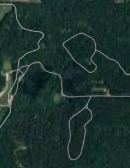
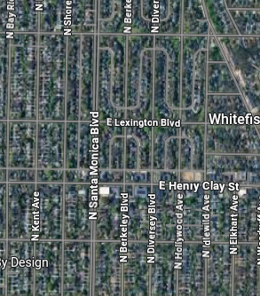

# EuroSAT Land Use Classifier

A deep learning pipeline that classifies satellite imagery into 10 land-use categories using a fine-tuned ResNet-18, served through a FastAPI backend and a lightweight web frontend — all containerized with Docker.

## Demo

| Forest | Residential |
|--------|-------------|
|  |  |

Upload any satellite image through the web UI and the model returns the predicted land-use class in real time. Uploaded images are preprocessed with OpenCV (CLAHE contrast enhancement) before inference.

## Tech Stack

- **Model:** ResNet-18 (ImageNet pre-trained, fine-tuned on EuroSAT RGB)
- **Training:** PyTorch — weighted random sampling, StepLR scheduler, 25 epochs
- **Backend:** FastAPI + Uvicorn
- **Image preprocessing:** OpenCV — CLAHE contrast enhancement before inference
- **Frontend:** Vanilla HTML/JS
- **Deployment:** Docker Compose

## Classes

The model classifies images into 10 land-use categories:

| Class | Val Accuracy |
|-------|-------------|
| SeaLake | 99.6% |
| Industrial | 99.4% |
| Forest | 99.3% |
| Highway | 99.2% |
| Residential | 99.0% |
| Pasture | 98.7% |
| River | 98.2% |
| HerbaceousVegetation | 98.0% |
| PermanentCrop | 97.4% |
| AnnualCrop | 97.3% |

## Project Structure

```
├── backend/
│   ├── main.py                  # FastAPI app — /predict/ endpoint
│   ├── Dockerfile
│   └── requirements-backend.txt
├── frontend/
│   ├── index.html               # Web UI
│   └── Dockerfile
├── scripts/
│   ├── train.py                 # ResNet-18 fine-tuning script
│   ├── inference.py
│   └── download_data.py
├── notebooks/
│   ├── validate.ipynb           # Per-class accuracy & confusion matrix
│   └── visual_check.ipynb
├── assets/                      # Example satellite images
├── docker-compose.yml
└── requirements-training.txt
```

## Running Locally

**Prerequisites:** Docker and Docker Compose installed.

1. **Download the trained model** and place it at `outputs/resnet18_eurosat.pth`

   > The model weights are not stored in this repo. You can either train from scratch (see below) or download the weights separately.

2. **Start the services:**

   ```bash
   docker compose up --build
   ```

3. Open `http://localhost:3000` in your browser, upload a satellite image, and click **Predict**.

## Training From Scratch

```bash
pip install -r requirements-training.txt
python scripts/download_data.py   # downloads EuroSAT RGB dataset
python scripts/train.py           # trains for 25 epochs, saves to outputs/
```

Training was done on a GPU. On CPU, expect significantly longer run times.

## Dataset

[EuroSAT](https://github.com/phelber/EuroSAT) — 27,000 labeled 64×64 satellite images across 10 classes, based on Sentinel-2 imagery.
