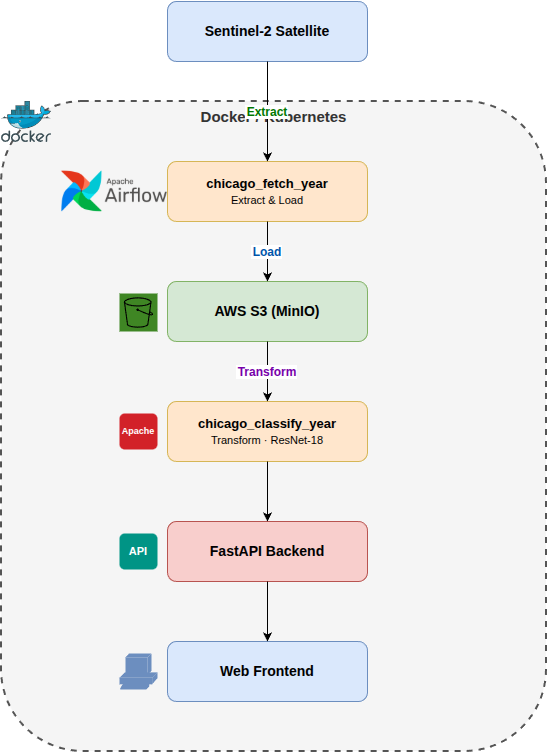
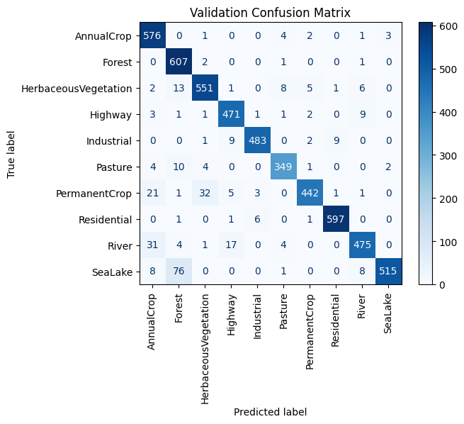

# Chicagoland Urban Land Use Intelligence Platform

Production ML system I designed and built end-to-end: Sentinel-2 satellite ingestion → dual-architecture computer vision → Kubernetes-native serving on AWS EKS → full Prometheus/Grafana observability. Built to demonstrate the same lifecycle ownership and engineering judgment I'd bring to a senior ML role — architecture decisions, MLOps discipline, fault-tolerant production design, and infrastructure a team could actually operate.

**Live demo:** Chicagoland land-use change, 2019–2024 · two model architectures · interactive Leaflet map with timeline + compare mode

---

## Why two models — an architecture decision, not a default

Most portfolio projects ship one model. I deliberately ran two, because the throughput-vs-fidelity trade-off between them is exactly what a lead engineer navigates on a real team:

- **ResNet-18** — fast, coarse tile classification (10 EuroSAT classes, ~3 min/year on CPU). Drives the time-series chart and change-detection catalog.
- **SegFormer-B2** — slow, precise pixel segmentation (7 LoveDA classes, full Sentinel-2 10 m/px resolution, sliding-window inference with overlap-averaging to eliminate seam artifacts at tile boundaries).

Same FastAPI backend, same Kubernetes serving infrastructure, single UI toggle. The system is architected to support both without forking the pipeline — because in production you rarely get to pick just one.

---

## Owning the full lifecycle

**Sentinel-2 ingestion via Copernicus CDSE API** (Apache Airflow-orchestrated, yearly schedule, ORBIT cloud-free median compositing, multi-tile AOI stitching around the 2,500 px API limit) → **training on AWS SageMaker or local GPU** (PyTorch, AMP, MLflow experiment tracking) → **MLflow Model Registry** (manual promotion gate, S3-versioned artifacts) → **FastAPI on AWS EKS** (Dockerized, autoscaled via HPA) → **Prometheus + Grafana monitoring** (custom metrics, auto-provisioned dashboards) → **all infrastructure as Terraform** (VPC, EKS, ECR, S3, IAM least-privilege).

Each stage fails independently and is independently testable — see fault tolerance below.

---

## MLOps practices implemented

- **CI (GitHub Actions):** ruff lint, Airflow DAG parse validation, Docker builds for backend + frontend, `kustomize build` dry-run for both dev and prod overlays, `terraform validate` — all before merge.
- **CD:** OIDC-authenticated deploys to AWS (no long-lived keys stored in GitHub), commit-SHA-tagged ECR images, `kubectl rollout` with timeout and automatic rollback on failure.
- **Model versioning:** S3-versioned artifacts + MLflow Model Registry, decoupled from application deploys via a Kustomize ConfigMap the CD pipeline patches post-promotion.
- **Experiment tracking:** every run — local RTX 3060 Ti or SageMaker `ml.p3.2xlarge` — logs params, per-epoch metrics, and artifacts to the same MLflow server. Comparable by design, not by convention.
- **Train/serve parity:** identical CLAHE preprocessing and domain-specific normalization (`[0.344, 0.380, 0.408]` Sentinel-2 channel stats, not ImageNet) applied in the Airflow ETL and the live `/predict/` endpoint. Eliminates the quiet accuracy degradation that hits real deployments when preprocessing diverges between training and serving.

---

## Designing for failure, not just success

- Pod readiness probes hit `/health` — a pod that fails to load either model is never added to the EKS load balancer pool. No silent degradation.
- SegFormer is optional at boot: ResNet-18 endpoints stay live even if segmentation weights are absent; `/seg/*` returns a clear 503 instead of crashing the service.
- S3 errors are classified — `NoSuchKey` (404) surfaces to the caller cleanly; transient 5xx errors propagate for upstream retry. No blanket exception swallowing.
- Local/offline fallbacks (MinIO S3, synthetic Chicagoland imagery, `LOCAL_DATA_DIR` filesystem mode) mean the full pipeline runs in CI and on a fresh laptop without real AWS credentials — saves a new engineer a day of setup friction. MinIO was chosen over LocalStack specifically because it persists data to a named Docker volume — satellite imagery fetched once stays available across restarts without re-spending Copernicus PU credits.

---

## Production engineering

**Kubernetes:** Kustomize base + dev (minikube, NodePort) / prod (EKS, NLB) overlays. HPA scales 2–10 replicas on CPU utilization. Image tags pinned per-deploy by the CD pipeline via `kustomize edit set image`. The dev overlay ships MinIO as an in-cluster S3-compatible store — same boto3 client, same bucket name, same key layout as prod AWS S3, only `AWS_ENDPOINT_URL` changes. This means the k8s dev environment is fully self-contained and validates the actual serving topology, not a mocked approximation of it.

**Storage parity across environments:** every environment in the stack uses the same S3 interface:

| Environment | Store | Endpoint |
|-------------|-------|----------|
| Local dev (docker-compose) | MinIO | `http://minio:9000` |
| k8s dev (minikube) | MinIO (in-cluster) | `http://minio:9000` |
| Production (EKS) | AWS S3 | AWS regional endpoint |

No code path changes between environments — `AWS_ENDPOINT_URL` is the only variable. Data written by the Airflow ETL in local dev persists across stack restarts in a named Docker volume; in k8s dev it persists in a PVC. The application never knows the difference.

**Observability:** custom Prometheus metrics — `landuse_predictions_total` (per-class counter, surfaces distribution drift), `landuse_inference_seconds` (histogram, 8 buckets, alerts if GPU degrades), `landuse_info` (gauge, tracks which model versions are loaded). Auto-provisioned Grafana dashboards at startup.

**Infrastructure:** full Terraform stack — VPC, EKS managed node group, ECR with lifecycle policies, S3 data lake + model registry, IAM roles with least-privilege, GitHub Actions OIDC federation.

---

## Architecture



---

## Model performance — ResNet-18 on EuroSAT

97.3–99.6% per-class validation accuracy across all 10 land-use classes.

| Class | Accuracy |
|---|---|
| SeaLake | 99.6% |
| Industrial | 99.4% |
| Forest | 99.3% |
| Highway | 99.2% |
| Residential | 99.0% |
| Pasture | 98.7% |
| River | 98.2% |
| HerbaceousVegetation | 98.0% |
| PermanentCrop | 97.4% |
| AnnualCrop | 97.3% |



---

## Stack

Python · PyTorch · HuggingFace Transformers · FastAPI · Apache Airflow · MLflow · Docker · Kubernetes (AWS EKS) · Terraform · AWS (SageMaker, S3, ECR) · Prometheus · Grafana · GitHub Actions

---

## Quickstart (no AWS account needed)

**Full stack (recommended):**
```bash
docker compose up -d        # starts everything: Airflow, backend, frontend, MinIO, MLflow, Grafana
docker compose up -d --build  # use after any Dockerfile change
docker compose down           # stop (data persists in named volumes)
docker compose down -v        # stop + wipe all data
```

Services:
- Frontend: http://localhost:3000
- Backend API: http://localhost:8000/docs
- Airflow: http://localhost:8080 (admin/admin)
- MinIO console: http://localhost:9011 (minioadmin/minioadmin)
- MLflow: http://localhost:5001
- Grafana: http://localhost:3001 (admin/admin)

**To run on minikube (tests the actual Kubernetes topology):**
```bash
make k8s-minikube-start    # spin up local cluster (Docker driver, 4 CPU / 4 GB)
make k8s-minikube-deploy   # build images, apply dev overlay (includes in-cluster MinIO)
make k8s-minikube-seed     # mirror chicago-land-use bucket from local MinIO → cluster MinIO
make k8s-minikube-url      # print service URLs
make k8s-minikube-stop     # pause cluster (data survives in PVC)
```

**To train SegFormer on real data (LoveDA dataset, ~5 hrs on RTX 3060 Ti):**
```bash
make train-pipeline           # downloads LoveDA → trains → regenerates masks → restarts backend
make train-pipeline-watch     # tail training logs + MLflow metrics
```

**To export ResNet-18 to ONNX for edge/runtime deployment:**
```bash
make export-onnx              # outputs/resnet18_eurosat.onnx — runs on ONNX Runtime, TensorRT, or any ONNX-compatible edge device
```

---

<details>
<summary>Architecture diagram + detailed runbook</summary>

See [docs/architecture.md](docs/architecture.md) and [docs/runbook.md](docs/runbook.md).

</details>
